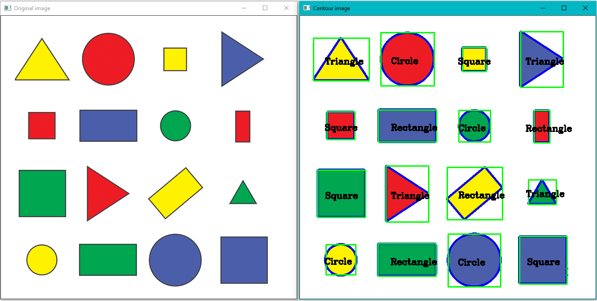

# Testing Open-CV

The objective of this project is to do some initial tests with opencv.

## Index

### Opening

1) [An image](src/open-image.py)  

  

2) [A video](src/open-video.py)  

  

3) [A webcam](src/open-webcam.py)  

### Manipulation

4) [Resizing and cropping image](src/resize-crop.py)  

  

5) [Editing image color](src/editing-image-color.py)  

  

6) [Drawing shapes and writing texts](src/shapes-texts.py)  

  

7) [Warping an image](src/warp-perspective.py)  

  

8) [Joining images](src/join-image.py)  

  

### Detection

9) [Color](src/color-detection.py)  

  

10) [Contours and shape](src/contours-shape-detection.py)  

  

11) [Face](src/face-detection.py)  

  

## Resources

* Images and videos: [pexels](https://www.pexels.com/)
* Reference: [Murtaza's workshop](https://www.youtube.com/watch?v=WQeoO7MI0Bs)
* Requirements: [file](venv/requirements.txt)